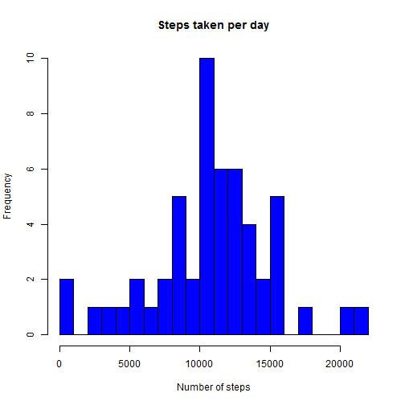
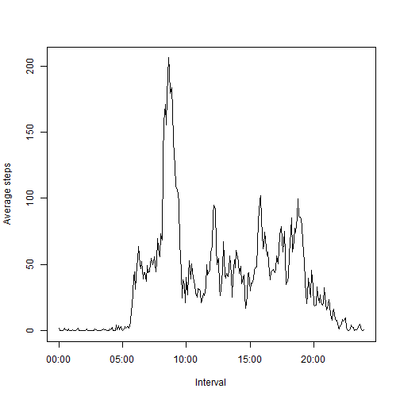
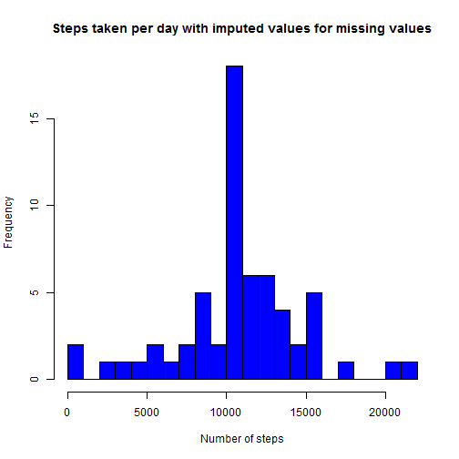
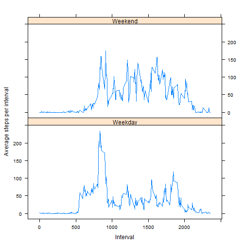

# Reproducible Research: Peer Assessment 1


## Loading and preprocessing the data
## First we need to load the data from activity.csv 


```r
df <- read.csv("activity.csv")
```
## Next we load the plyr library and use the ddply function to create 


```r
library(plyr)
```
## Now to develop 2 data frames based around nubmers of steps in particular intervals
- Sums of steps per day
- Average steps per interval of time


```r
byDaySummary <- ddply(df, .(date), summarise, stepsPerDay = sum(steps))
byIntervalSummary <- ddply(df, .(interval), summarise, averageStepsPerInterval = mean(steps,na.rm=TRUE))
```


## The interval variable measures five minute intervals from 0 to 55 before incremeting an hour.
- To fix this, a vector is created using date and time for each of the 5 minutes intervals.


```r
intervals24hour <- strptime(formatC(df$interval[1:288],width = 4, format = "d", flag = "0"), "%H%M")
byIntervalSummary <- cbind(intervals24hour, byIntervalSummary)
```

## What is mean total number of steps taken per day?

Checking out the breakdown of the steps per day


```r
hist(byDaySummary$stepsPerDay,
breaks = 30,
col="blue",
main = "Steps taken per day",
xlab = "Number of steps")
```

 

```r
meanStepsPerDay <- round(mean(byDaySummary$stepsPerDay,na.rm=TRUE))
medianStepsPerDay <- round(median(byDaySummary$stepsPerDay,na.rm=TRUE))
```


The mean number of steps per day is 10766
The median number of steps per day is 10765


## What is the average daily activity pattern?

While plotting average steps per interval, it is possible to further review Again to get an overview of the average daily activity pattern, we can plot the number of steps in each interval averaged across the two months


```r
plot(byIntervalSummary$intervals24hour,byIntervalSummary$averageStepsPerInterval,
type = "l",  
xlab = "Interval",  
ylab = "Average steps")
```

 

## Furthermore, the maximum activity interval can be extracted. 


```r
maxActivityInterval <- byIntervalSummary$interval[which.max(byIntervalSummary$averageStepsPerInterval)]
```
The maximum average activty is at 8:35am


## Imputing missing values

Firstly, need to review how many values are missing from the dataset


```r
numberOfMissingValues <- sum(is.na(df$steps))
```

There are 2304 missing values in the data


## The next piece of codes replaces missing steps values with the average for that interval across all days and places it in a data frame called dfImputed


```r
locationNA <- is.na(df$steps)
```
There are 61 days, therefore repeat 61 times

```r
intervalMeansExtension <- as.data.frame(rep(byIntervalSummary$averageStepsPerInterval, times = 61)) 
names(intervalMeansExtension)  <- c("intervalMeansExtension")
```

## Append on interval Mean Extension data frame

```r
dfImputed <- cbind(df, intervalMeansExtension)
dfImputed$steps[locationNA]<- dfImputed$intervalMeansExtension[locationNA]
```

## Examine the same frequnecy histogram and examine impact.


```r
byDaySummaryImputed <- ddply(dfImputed, .(date), summarise, stepsPerDay = sum(steps,na.rm=TRUE))
```


```r
hist(byDaySummaryImputed$stepsPerDay,
     breaks = 30,
     col="blue",
     main = "Steps taken per day with imputed values for missing values",
     xlab = "Number of steps")
```

 

```r
meanStepsPerDayImputed <- round(mean(byDaySummaryImputed$stepsPerDay))
medianStepsPerDayImputed <- round(median(byDaySummaryImputed$stepsPerDay))
```

The mean number of steps per day is 10766
The median number of steps per day is 10766

The mean and medium are essentially the same as last time.

## Are there differences in activity patterns between weekdays and weekends?

Now we want to compare activity difference between weekdays and weekends. First we need to create a suitable factor variable from the date column.
Assign day of week to each record.


```r
df$DayOfWeek <- as.factor(weekdays(as.Date(df$date)))
```
Replace day of week with type of day it is.

```r
levels(df$DayOfWeek) <- c("Weekday","Weekday","Weekend","Weekend","Weekday","Weekday","Weekday")
```
Now again we make a by interval summary of steps taken but this time seperating out into the weekends from the weekdays before we make the average.
Then we can generate a plot of interval vs average steps per interval conditioned on weekday vs weekend.


```r
byIntervalSummaryWeekdayWeekend <- ddply(df, .(interval, DayOfWeek), summarise, averageStepsPerInterval = mean(steps, na.rm=TRUE))
```

## Summary of type of day per time interval


```r
library(lattice)
```


```r
xyplot(byIntervalSummaryWeekdayWeekend$averageStepsPerInterval ~ byIntervalSummaryWeekdayWeekend$interval | byIntervalSummaryWeekdayWeekend$DayOfWeek,
       type = "l", layout = c(1,2),
       xlab = "Interval",
       ylab = "Average steps per interval")
```

 

## USing a xy plot it is possible to see there is significant difference in activity from weekday to weekend.

```r
knit2html("ReproducibleResearch_assignment1.Rmd")
```

```
## 
## 
## processing file: ReproducibleResearch_assignment1.Rmd
```

```
## 
  |                                                                       
  |                                                                 |   0%
  |                                                                       
  |..                                                               |   3%
##   ordinary text without R code
## 
## 
  |                                                                       
  |...                                                              |   5%
## label: unnamed-chunk-20
## 
  |                                                                       
  |.....                                                            |   8%
##   ordinary text without R code
## 
## 
  |                                                                       
  |.......                                                          |  11%
## label: unnamed-chunk-21
## 
  |                                                                       
  |.........                                                        |  13%
##   ordinary text without R code
## 
## 
  |                                                                       
  |..........                                                       |  16%
## label: unnamed-chunk-22
## 
  |                                                                       
  |............                                                     |  18%
##   ordinary text without R code
## 
## 
  |                                                                       
  |..............                                                   |  21%
## label: unnamed-chunk-23
## 
  |                                                                       
  |...............                                                  |  24%
##   ordinary text without R code
## 
## 
  |                                                                       
  |.................                                                |  26%
## label: unnamed-chunk-24
```

```
## 
  |                                                                       
  |...................                                              |  29%
##   ordinary text without R code
## 
## 
  |                                                                       
  |.....................                                            |  32%
## label: unnamed-chunk-25
```

```
## 
  |                                                                       
  |......................                                           |  34%
##   ordinary text without R code
## 
## 
  |                                                                       
  |........................                                         |  37%
## label: unnamed-chunk-26
## 
  |                                                                       
  |..........................                                       |  39%
##   ordinary text without R code
## 
## 
  |                                                                       
  |...........................                                      |  42%
## label: unnamed-chunk-27
## 
  |                                                                       
  |.............................                                    |  45%
##   ordinary text without R code
## 
## 
  |                                                                       
  |...............................                                  |  47%
## label: unnamed-chunk-28
## 
  |                                                                       
  |................................                                 |  50%
##   ordinary text without R code
## 
## 
  |                                                                       
  |..................................                               |  53%
## label: unnamed-chunk-29
## 
  |                                                                       
  |....................................                             |  55%
##   ordinary text without R code
## 
## 
  |                                                                       
  |......................................                           |  58%
## label: unnamed-chunk-30
## 
  |                                                                       
  |.......................................                          |  61%
##   ordinary text without R code
## 
## 
  |                                                                       
  |.........................................                        |  63%
## label: unnamed-chunk-31
## 
  |                                                                       
  |...........................................                      |  66%
##   ordinary text without R code
## 
## 
  |                                                                       
  |............................................                     |  68%
## label: unnamed-chunk-32
```

```
## 
  |                                                                       
  |..............................................                   |  71%
##   ordinary text without R code
## 
## 
  |                                                                       
  |................................................                 |  74%
## label: unnamed-chunk-33
## 
  |                                                                       
  |..................................................               |  76%
##   ordinary text without R code
## 
## 
  |                                                                       
  |...................................................              |  79%
## label: unnamed-chunk-34
## 
  |                                                                       
  |.....................................................            |  82%
##   ordinary text without R code
## 
## 
  |                                                                       
  |.......................................................          |  84%
## label: unnamed-chunk-35
## 
  |                                                                       
  |........................................................         |  87%
##   ordinary text without R code
## 
## 
  |                                                                       
  |..........................................................       |  89%
## label: unnamed-chunk-36
## 
  |                                                                       
  |............................................................     |  92%
##   ordinary text without R code
## 
## 
  |                                                                       
  |..............................................................   |  95%
## label: unnamed-chunk-37
```

```
## 
  |                                                                       
  |...............................................................  |  97%
##   ordinary text without R code
## 
## 
  |                                                                       
  |.................................................................| 100%
## label: unnamed-chunk-38
```

```
## output file: ReproducibleResearch_assignment1.md
```

 
